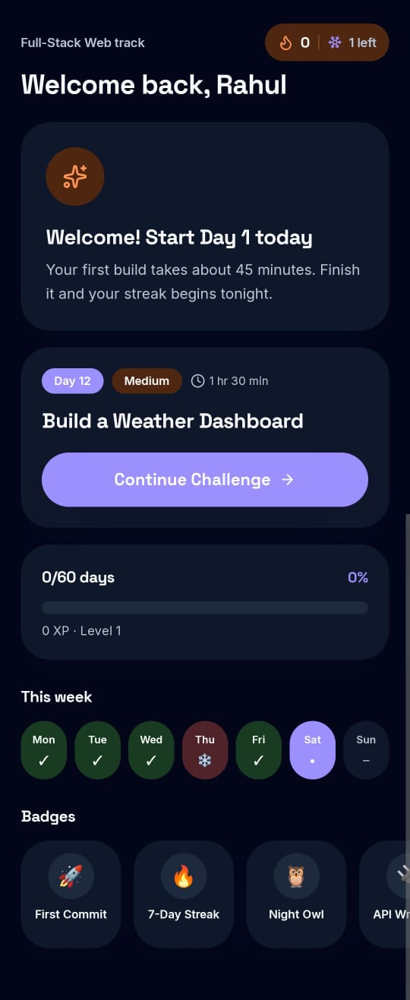
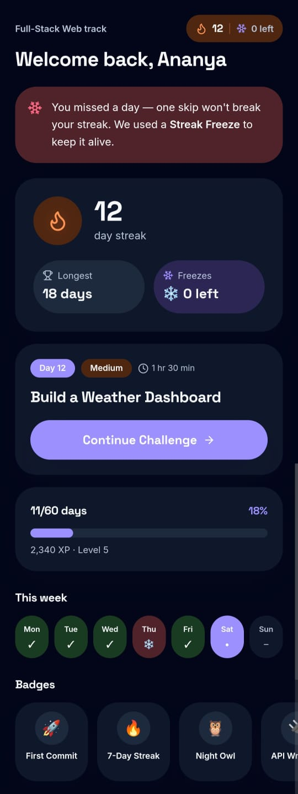
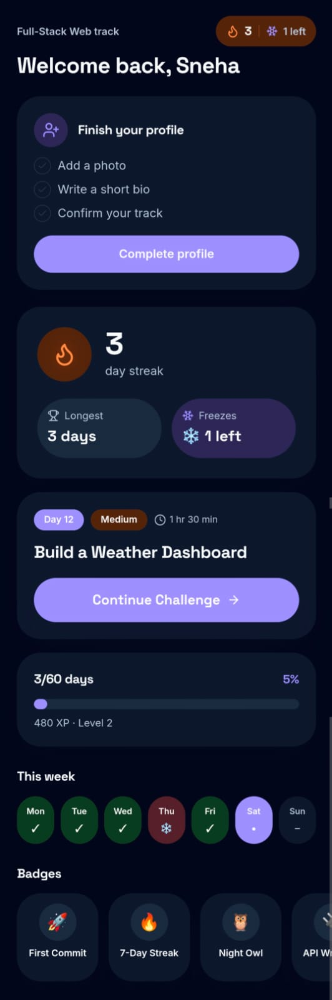
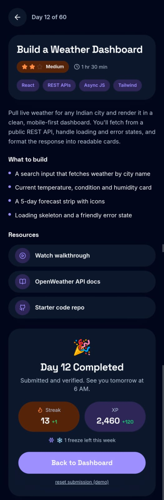

# ABTalks Streak Builder

A mobile-first redesign of ABTalks' student experience for a 60-day coding
challenge (built for the Vocodathone hackathon). Students track a daily
streak, complete a coding task, and submit proof of work (GitHub commit +
LinkedIn post) — designed for how it's actually used: on a phone, late at
night, after class.

**Routes:** `/` · `/dashboard` · `/day/12`
**Stack:** React + Vite + Tailwind + React Router. All data is mocked
(`src/data/mockData.js`) — no auth, no backend, no database, per the
challenge scope.

## Walkthrough
[Watch the demo](https://drive.google.com/file/d/1O277fbwtP0XhIMMcz_qohCkn_n8qjUxH/view?usp=drive_link)

## How to use
1. **Land on the homepage** (`/`) — read what ABTalks is, then tap
   "Start the Challenge."
2. **Check your dashboard** (`/dashboard`) — your home base. See your
   current streak, today's task, and how far you've gotten through the 60 days.
3. **Tap "Continue Challenge"** — opens today's task, with what to build
   and how long it should take.
4. **Build the task**, then paste your GitHub repo link and LinkedIn post
   link into the submission form.
5. **Tap Submit** — you'll see a "Day Completed" celebration and your
   streak updates right away.
6. **Come back tomorrow** — your progress is saved in the browser, and the
   cycle repeats until Day 60.

## Signature feature — Streak Freeze
Each student gets 1 free freeze per week. Missing a day burns a freeze
instead of resetting the streak to 0 — shown as a small ❄️ counter next to
the flame wherever streak appears.

## Edge cases

| State | Behavior | Screenshot |
|---|---|---|
| First day (streak = 0) | Streak card swaps for an encouraging "Start Day 1 today" prompt, not a bare 0 |  |
| Missed a day | Soft banner explains Streak Freeze covered it — no guilt messaging |  |
| Empty profile | Checklist banner above the fold prompts photo / bio / track |  |
| Day submitted | Form is replaced by a celebration state, persisted via localStorage across refresh |  |

## Testing edge cases
The dashboard has a small debug chip (bottom-left) that switches the mock
student state between New / Active / Missed / Empty-profile — for reviewers
only, not part of the real product. Automated screenshots only capture the
default state, so use the chip to preview each edge case manually — the
images above were captured this way.

## Run locally
```sh
git clone <repo-url>
cd streak-freeze-spark
npm i
npm run dev
```
